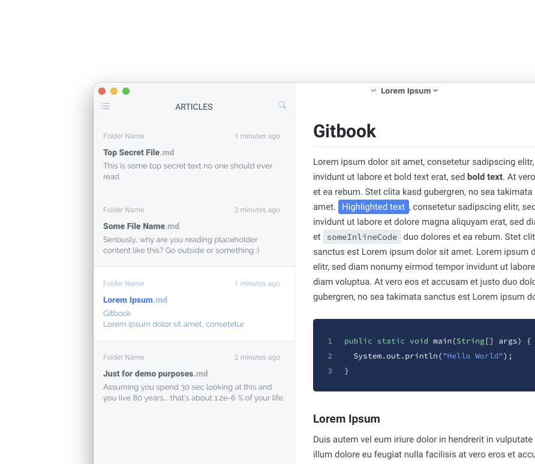
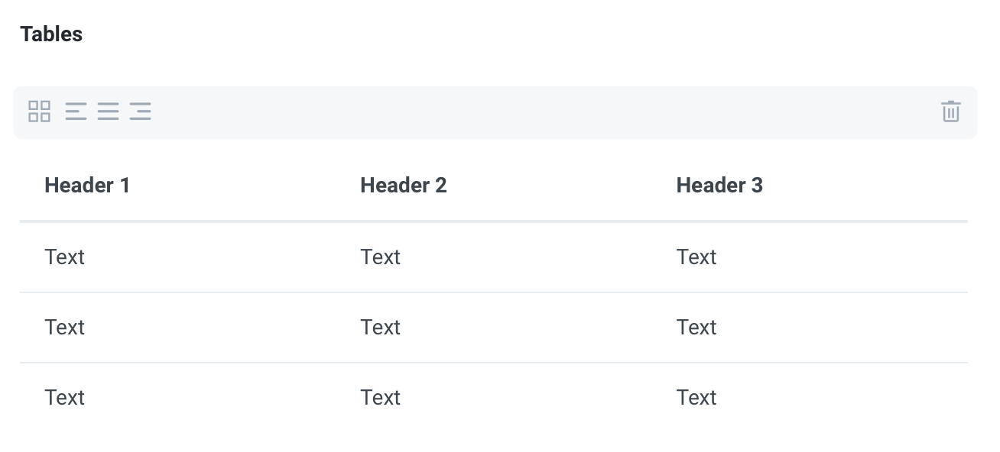

# Gitbook Theme For Typora

This typora theme is inspired by the [Gitbook](https://www.gitbook.com) document style. It features three variants: *Azure*, *Slate* and *Teal*.

> Designed and tested on Windows 10 and macOS. Not tested, but it should also work for Linux.
## Installation instructions
1. Download the zipped project package [here](https://github.com/Henning16/typora-gitbook-theme/releases/latest) and un-zip it.
2. Copy the `gitbook-azure.css`, `gitbook-slate.css` and `gitbook-teal.css` file as well as the folder named `gitbook` to your Typora theme library. **It is important that you put this folder in there too as it contains important files and fonts, which are required for the theme to work properly.**
4. Launch or restart Typora and choose *Gitbook Azure*, *Gitbook Slate*, *Gitbook Teal* from the theme menu.

## Contributing
Feel free [to submit an issue](https://github.com/Henning16/typora-gitbook-theme/issues/new), if something does not work / look right or you have any suggestions. If you would like to, you can also create your own variations of this theme. 

> **Please note** that this theme is still in development. Regular updates are to expect.

## Modfications
If you prefer the colors of the slate variant used previous to version 1.9 (these were slightly lighter and more slate-like), you can open the file `gitbook-slate.css` and change the second line from `@import "gitbook/slate-colors.css";` to `@import "gitbook/old-slate-colors.css";`. After that you have to save the file and restart Typora for the colors to update properly. Sometimes it may also be necessary to switch to a different theme and then back to the Gitbook Slate theme after changing this.

You can also put these modifications into a seperate css file [as @chen-standford points out here](https://github.com/16soundsofsilence/typora-gitbook-theme/issues/14#issuecomment-784175419).

## Details

## Older Screenshots

These screenshots are not fully up to date but they show the slate and teal variants and some Windows specific views.

