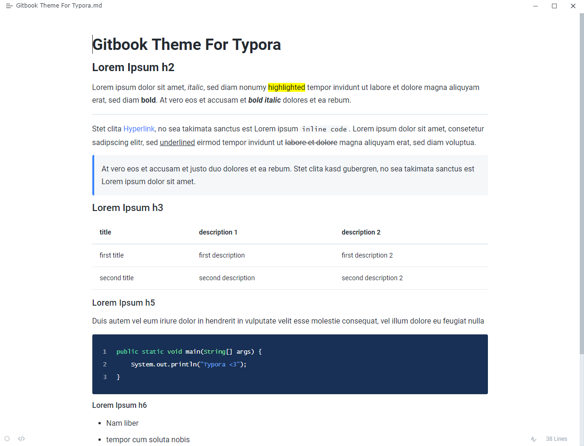

# Gitbook Theme For Typora
This typora theme is inspired by the [Gitbook](https://www.gitbook.com) document style. Nearly all user interfaces have been redesigned. It contains both a light and a dark theme. For best experience turn on `Preference Panel > Appearance > Unibody`.

> This theme has been developed and tested for Windows 10 (both Classic and Unibody style). It has not been tested on macOS nor Linux. However, the core theme (not the UI still should still work).
## Installation instructions
1. Download the zipped project package.
2. Copy the `gitbook-light.css` file and `gitbook-dark.css` file as well as the folder `gitbook` to your Typora theme library.
3. Launch or restart Typora and choose Gitbook Light or Gitbook Dark from the theme menu.

## Contributing
Feel free to submit an issue, if something does not work or look right. If you would like to, you can also create your variant of this theme. 

## Screenshots

### Light

### Dark

